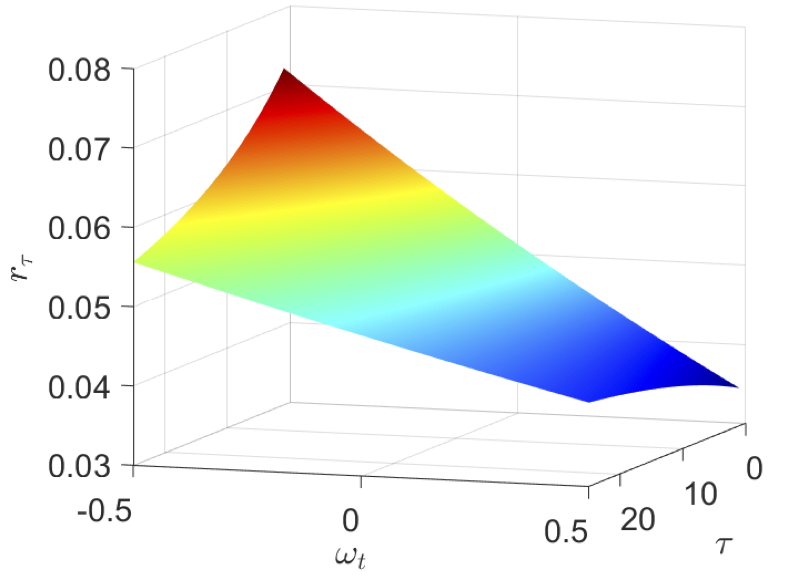

---

##### News 📣

+ 5/2025 Presentation at SFS Cavalcade at Stevens Institute of Technology   

---

##### Download

+ [Paper coming soon!]

---

##### Abstract

What is the role of belief heterogeneity in shaping the equity term structure? We address this question by developing a general equilibrium model with habit formation in consumption and heterogeneity in both risk aversion and beliefs about the expected growth rate of the aggregate endowment. We demonstrate that the effects of belief heterogeneity are countercyclical, increasing equity yields during recessions and reducing them during expansions. These effects are also more pronounced in recessions than in expansions and are stronger for short-term assets than for long-term assets. Our findings underscore the significant role of belief heterogeneity in determining equity yields.

---

##### Figure 4: Cyclicality of equity yields

---

<!-- ##### Citation

Prinzel, Florianus, and Moritz-Maria von Igelfeld. 2004. "The Finer Points of Sausage Dogs." *Journal of Canine Science* 43 (2): 89–109. http://www.alexandermccallsmith.com/book/the-finer-points-of-sausage-dogs.

--- -->

##### Related Material

+ [Slides coming soon!]