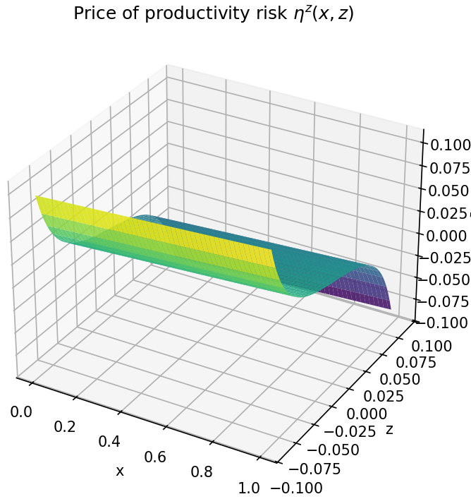

---

##### Download:

- [Paper](coming soon!)
<!-- - [Online appendix](appendix.pdf)
- [Code and data](https://github.com/paper_repo) -->

---

<!-- ##### Abstract:

--- -->

##### Investment and Asset Prices

---

<!-- ##### Figure X:  Figure title

---

##### Citation

Author 1, Author 2. Year. "Title." *Journal* Volume (Issue): First page–Last page. https://doi.org/paper_doi.

---

##### Related material

+ [Presentation slides](presentation.pdf) -->