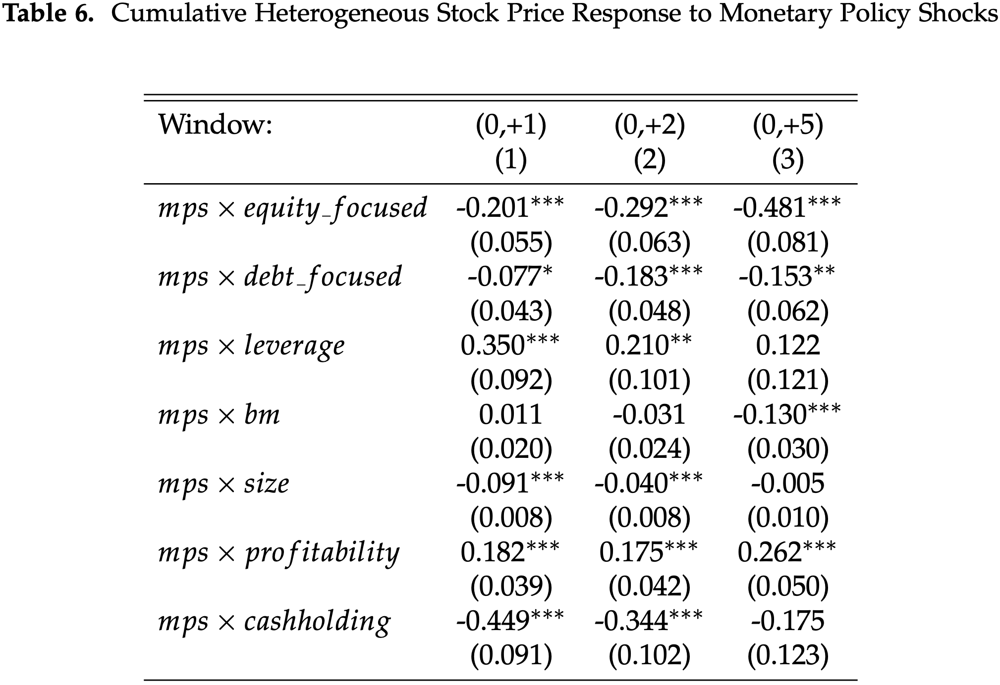
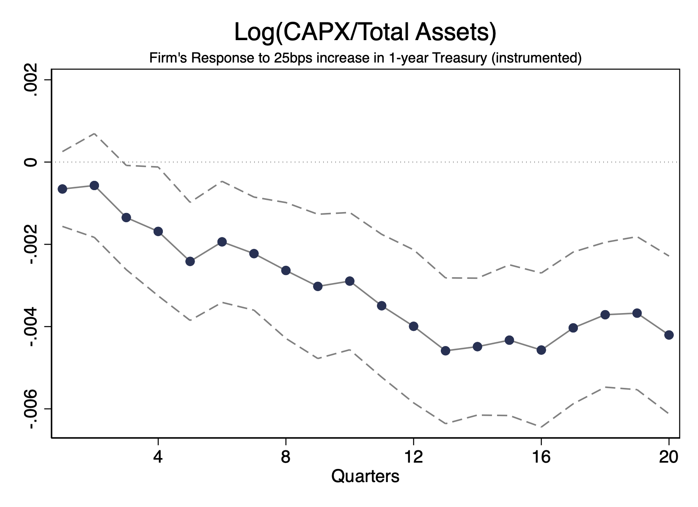
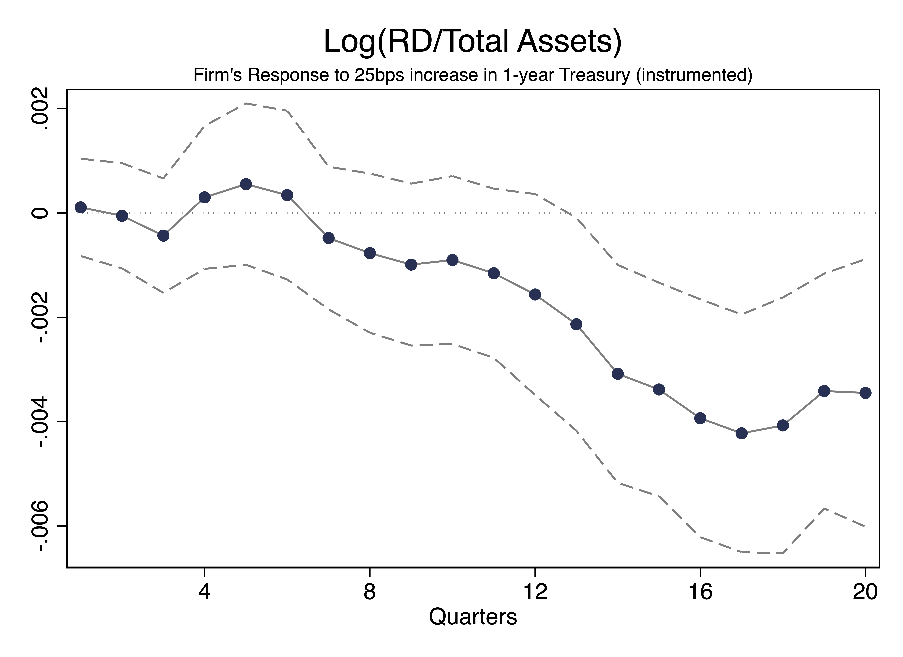
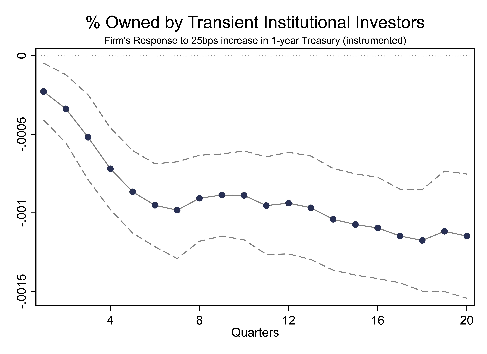

---

##### News 📣

+ 8/2026 Presentation at *EFA* in Ghent, Belgium  
+ 6/2026 Presentation at *CICF* in Hong Kong, China  
+ 5/2026 Presentation at *FIRS* in FL  
+ 5/2026 Presentation at *SFS Cavalcade* in VA  
+ 6/2025 Presentation at *WFA* in UT

---

##### Download (New version coming soon)

+ [Paper](AJOZ_03232026.pdf)
+ [Slides](ajoz_09-2025.pdf)

---

##### Abstract

We use a measure of financial constraint that distinguishes between a company's emphasis on equity versus debt financing to show that equity-focused constrained firms endure larger declines in stock prices and implement deeper cuts in investments when faced with contractionary monetary policy shocks. Equity-focused constrained firms reduce equity issuance and are more reluctant to run down cash holdings in response to tighter monetary policy. Contractionary shocks reduce investor demand for the equity of constrained firms, increasing their cost of capital. Our findings suggest that equity frictions are central to understanding the transmission of monetary policy to the corporate sector.

---

##### Amplification of equity financing constraint

---

<!-- ##### Citation

Almeida, Heitor and Johnson, Timothy C. and Oliveira, Sebastiao and Zhou, Yucheng, The Equity Constraint Channel of Monetary Policy (August 07, 2025). Available at SSRN: https://ssrn.com/abstract=5031788 or http://dx.doi.org/10.2139/ssrn.5031788

--- -->

<!-- ##### Related material

+ [Presentation slides](uiuc_11-12-2024.pdf) -->
