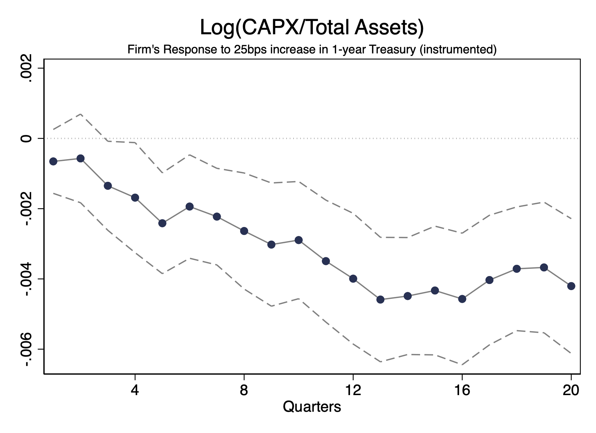

---

##### News 📣

+ 3/2025 Presentation at MFA in Chicago IL  
+ 6/2025 Presentation at WFA in Snowbird UT

---

##### Download

+ [Paper](mpfc.pdf)

---

##### Abstract

Our study reveals that equity financing constraints play a unique role in the amplification of monetary policy shocks. By using a text-based metric of financial constraint that distinguishes between a company’s emphasis on equity versus debt financing, we show that equity-focused constrained firms endure more substantial declines in stock prices and implement deeper cuts in capital expenditure and R&D when faced with a contractionary monetary policy shock. These declines are translated into reductions in innovation output (e.g., patents). Equity-focused constrained firms significantly reduce equity issuance and are more reluctant to run down cash holdings in response to tighter monetary policy. The greater impact of monetary tightening on equity-focused firms is linked to fluctuations in investor demand that increase the cost of capital for these firms after contractionary shocks. Our findings suggest that the transmission of monetary policy to the corporate sector significantly rely on changes in equity financing terms.

---

##### Amplification of equity financing constraint

---

##### Citation

Almeida, Heitor and Johnson, Timothy C. and Oliveira, Sebastiao and Zhou, Yucheng, The Equity Constraint Channel of Monetary Policy (August 07, 2025). Available at SSRN: https://ssrn.com/abstract=5031788 or http://dx.doi.org/10.2139/ssrn.5031788

---

##### Related material

+ [Presentation slides](uiuc_11-12-2024.pdf)
