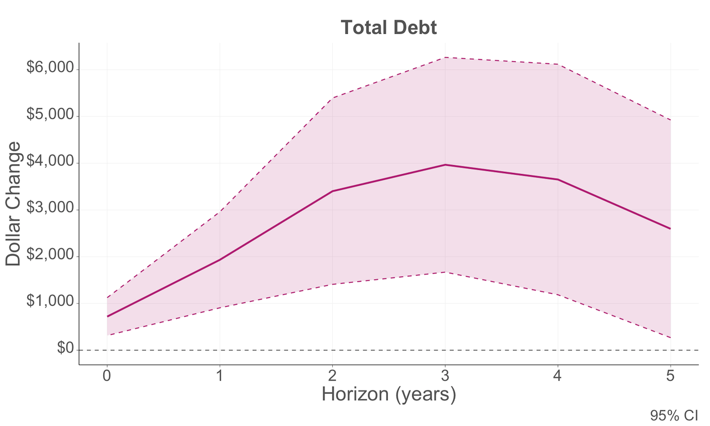
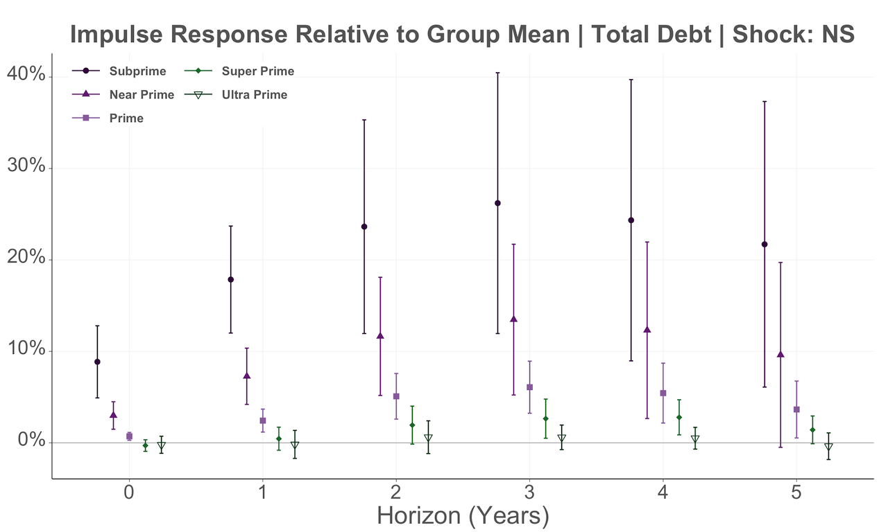
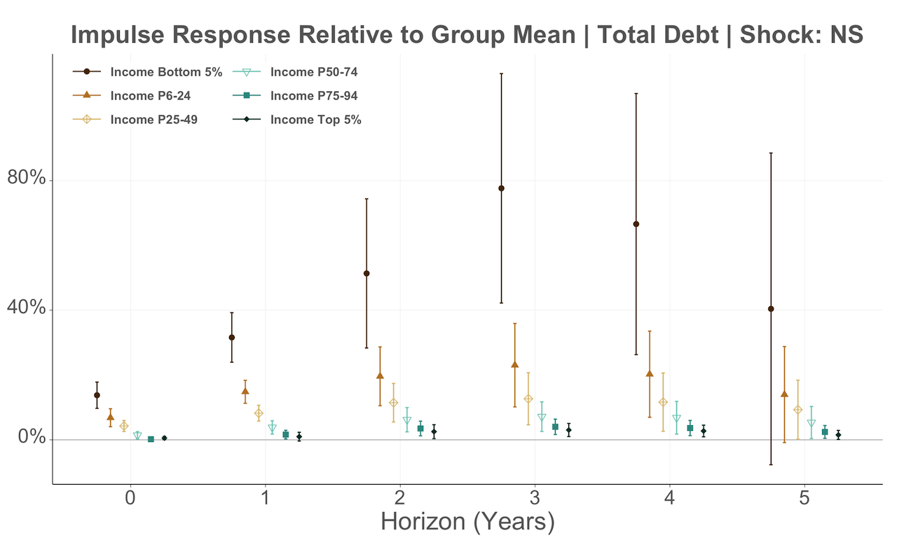

---
##### News 📣

+ 5/2026 Poster at Boulder Summer Conference on Consumer Financial Decision Making in CO  

---
##### Download:
+ [Draft coming soon!]
<!-- - [Paper](paper.pdf)
- [Online appendix](appendix.pdf)
- [Code and data](https://github.com/paper_repo) -->

---

##### Description:
This paper utilizes detailed household credit bureau data and trace out the transmission of monetary policy. We find that households with low income or vantage score increase their credit balance after contractionary shocks, while households with high income or vantage score decrease.

---

<!-- ##### Abstract:

--- -->

##### Average IRF of Total Debt Balance

---

##### Heterogeneous IRF of Total Debt Balance

---

<!-- 
##### Citation

Author 1, Author 2. Year. "Title." *Journal* Volume (Issue): First page–Last page. https://doi.org/paper_doi.

---

##### Related material

+ [Presentation slides](presentation.pdf) -->