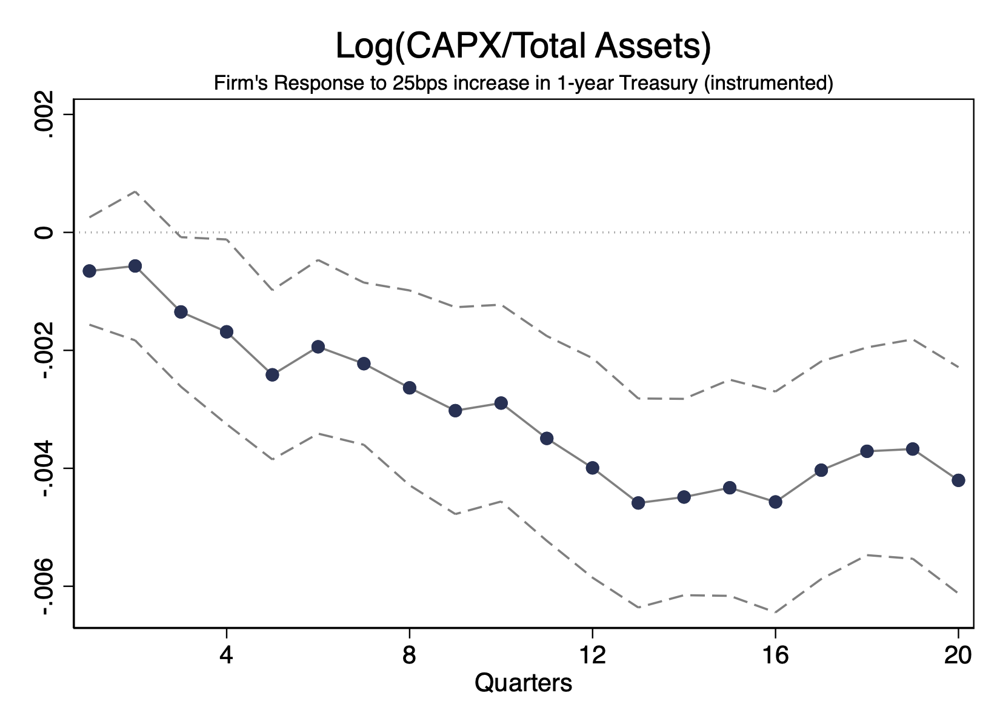

---

##### Download

+ [Paper](mpfc.pdf)

---

##### Abstract

Our study reveals that equity financing constraints play a unique role in the amplification of monetary policy shocks. By using a text-based metric of financial constraint that distinguishes between a company’s emphasis on equity versus debt financing, we show that equity-focused constrained firms endure more substantial declines in stock prices and implement deeper cuts in capital expenditure and R\&D when faced with a contractionary monetary policy shock. These declines are translated into reductions in innovation output (e.g., patents). Equity-focused constrained firms significantly reduce equity issuance and are more reluctant to run down cash holdings in response to tighter monetary policy, while debt-focused constraints do not seem to play an economically significant role in magnifying the impact of monetary policy shocks. Our findings suggest that the transmission of monetary policy shocks to the corporate sector may not significantly rely on changes in debt financing terms.

---

##### Figure 3: Amplification of equity financing constraint

---

##### Citation

Almeida, Heitor and Johnson, Timothy C. and Oliveira, Sebastiao and Zhou, Yucheng, The Role of Equity Financing Constraints in the Transmission of Monetary Policy (September 16, 2024). Available at SSRN: https://ssrn.com/abstract=5031788 or http://dx.doi.org/10.2139/ssrn.5031788

---

##### Related material

+ [Presentation slides](uiuc_11-12-2024.pdf)
